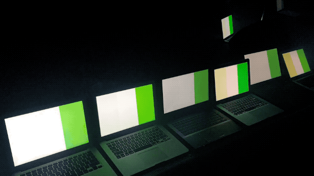
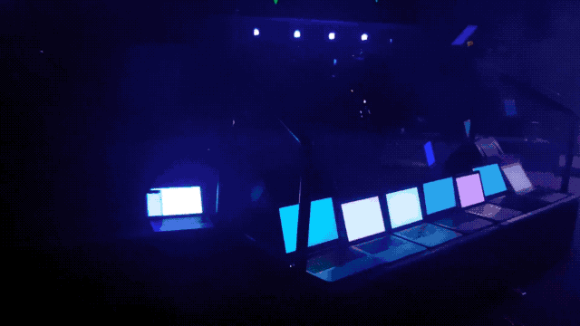

# CRAVE
I created this project for a dance party at my youth group. I had about 20 devices all flash the same sequence of colours at the same time. They simply had to go to the IP address of the node.js server and then once the colours were sent, they would all flash in time.





## /host
You can go to /host to send a sequence of colours and tempo to flash at

## How It Works

1. Using sockets, the server gets a message from /host with a sequence of colours and a sequence interval, eg. red, blue, green, 50ms apart
2. The server makes a point in time when the sequence will start running across all of the devices. This is created using a minimum time constant, the current server time, and the length of the new sequence.
3. The server continually updates this start time so that new clients can join and start on the beat
4. A message with the new colours and sequence interval is sent using sockets to the clients

5. The clients work out the offset between their time and the server time. The network lag is factored in to make a more accurate measure of the server time using NTP. NTP is approximate and so pefect synchronisation cannot be guaranteed or expected.
6. Clients timeout until the start time set by the server and then at an interval, update their background-color to fit the next colour in the sequence.

## Setup

1. Install Node.js
2. In the directory run ```npm run install```
3. In the directory run ```node server.js```
4. Go to the address of the server to connect as a flashing device
5. Go to the address of the server and then /host to send out the sequences and tempo

### Notes
This project was made for a small youth group gathering of about 80 people. It worked well and I didn't have any issues. The youth could connect their phones, but what I found worked best was having devices with large screens scattered around the room pointing inwards. Everything worked as planned.

This project is could be optimised in a few ways. For example, the network lag between the /host and the node server has not been accounted for. However the network lag between the clients and the server has been.


